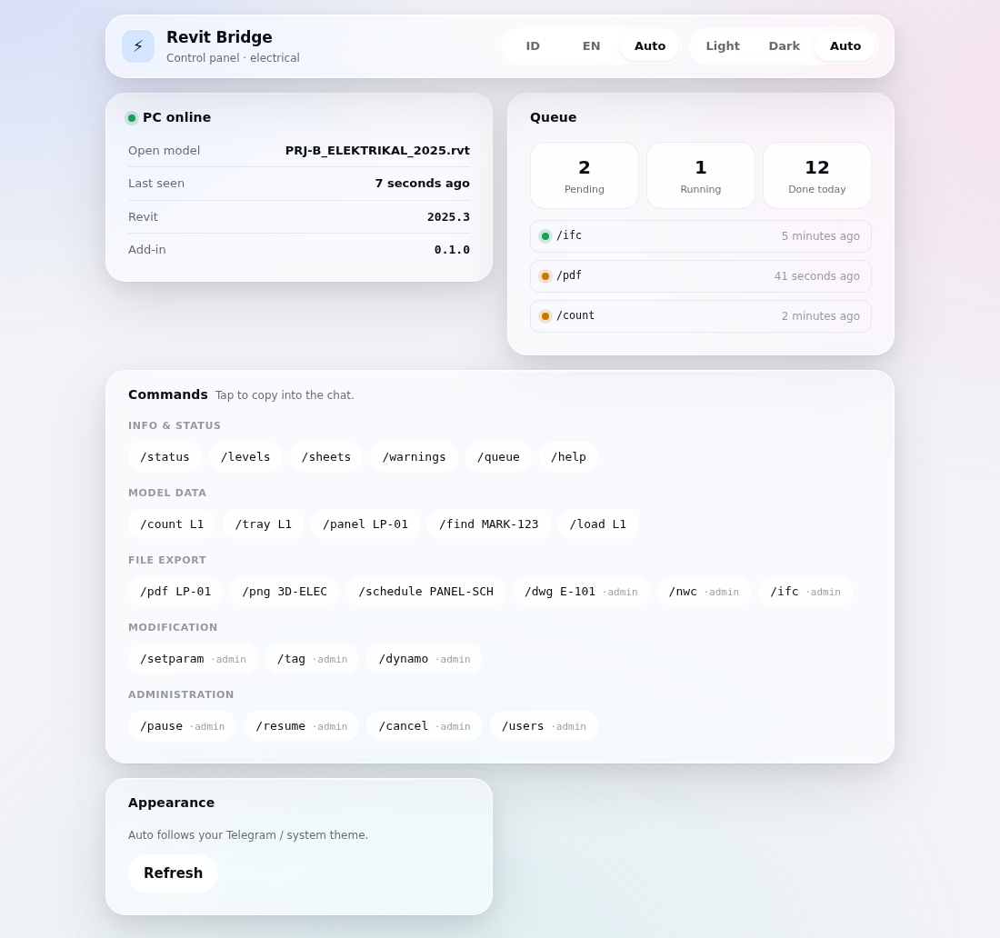
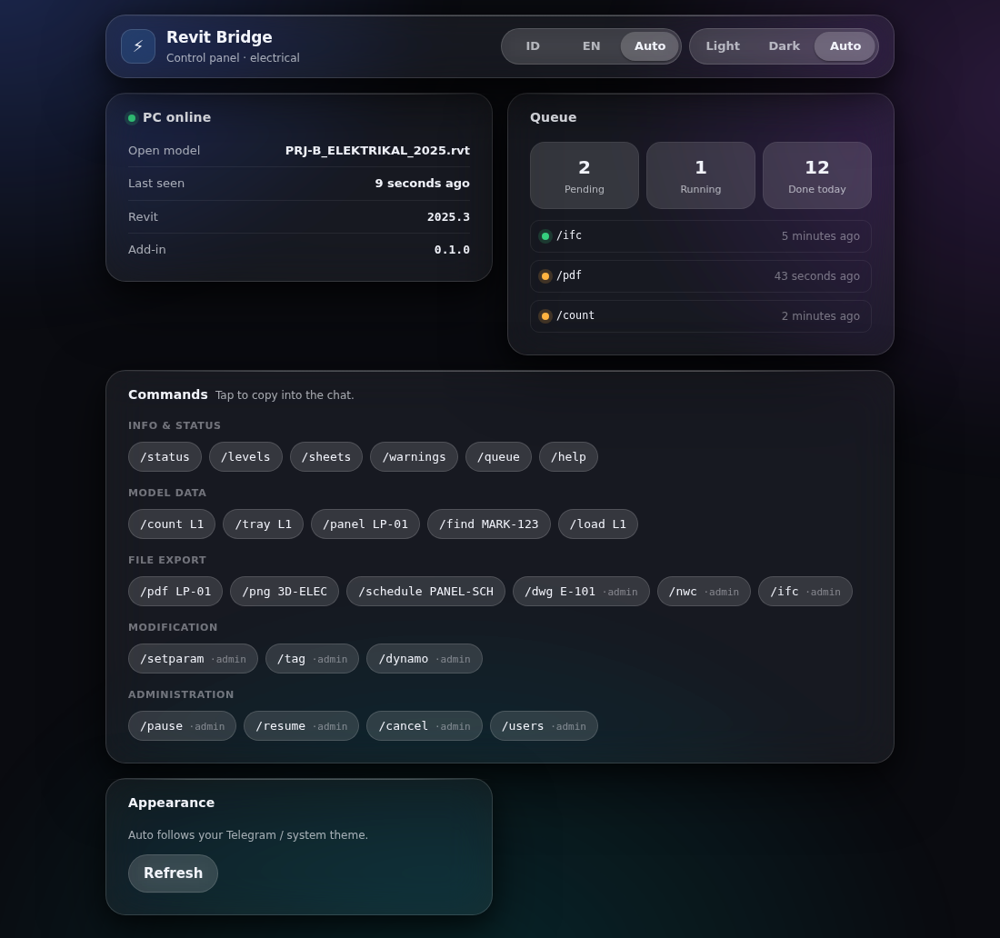

# Dual Theme — "Liquid Glass"

Bahasa: Indonesia (istilah teknis dibiarkan dalam bahasa aslinya)

Dua tema untuk panel web: **light** (basis, putih seperti sekarang) dan **dark**.
Keduanya memakai material yang sama — kaca tembus dengan blur besar — bukan satu
tema yang di-invert.

Berkas: `web/theme.css` (token + material), `web/panel.css` (tata letak),
`web/theme.js` (pemilihan tema).

| Terang (basis) | Gelap |
|---|---|
|  |  |

*Tangkapan layar dirender langsung dari `web/index.html` dengan data contoh.*

---

## 1. Cara tema dipilih

Urutan menang, dari atas:

```
1. :root[data-theme="light"|"dark"]     ← pilihan eksplisit user
2. @media (prefers-color-scheme: dark)   ← OS / Telegram
3. nilai default di :root                ← light
```

Preferensi disimpan tiga nilai: `light`, `dark`, `auto`.

**Aturan yang paling mudah dilanggar:** saat preferensi `auto`, atribut
`data-theme` harus **dihapus**, bukan diisi dengan hasil deteksi.

```js
if (preference === 'auto') root.removeAttribute('data-theme');
else root.setAttribute('data-theme', preference);
```

Kalau `auto` ditulis sebagai `data-theme="light"`, panel terkunci terang
selamanya: media query tidak akan pernah dapat giliran, dan HP yang berpindah ke
mode gelap saat malam tidak ikut berubah.

Konsekuensinya di CSS: blok gelap ditulis **dua kali** — sekali di dalam
`@media (prefers-color-scheme: dark)` dengan selector
`:root:not([data-theme='light'])`, sekali lagi sebagai `:root[data-theme='dark']`.
Duplikasi itu disengaja. Itu satu-satunya cara pilihan eksplisit mengalahkan
media query di kedua arah tanpa menempelkan `!important` ke setiap properti.

Di dalam Telegram Mini App, sumber `auto` yang pertama adalah
`Telegram.WebApp.colorScheme`, baru `prefers-color-scheme`. Event `themeChanged`
di-listen, tapi hanya berpengaruh saat preferensi `auto`.

---

## 2. Kenapa gelap bukan hasil invert

Kaca terang = lapisan **putih** semi-transparan di atas latar terang.
Kaca gelap = lapisan **putih** ber-alpha sangat rendah di atas latar gelap —
bukan lapisan hitam.

```css
/* terang */            /* gelap */
--glass-1: rgba(255,255,255,.55);   --glass-1: rgba(255,255,255,.06);
--glass-2: rgba(255,255,255,.68);   --glass-2: rgba(255,255,255,.09);
--glass-3: rgba(255,255,255,.82);   --glass-3: rgba(255,255,255,.13);
```

Alpha hitam di atas latar gelap menghasilkan lubang mati: tidak ada cahaya yang
lewat, dan panel terlihat seperti tempelan datar. Putih ber-alpha rendah tetap
membawa sedikit cahaya, dan itulah yang membuat permukaannya terbaca sebagai
kaca.

Bayangan juga tidak simetris. Di tema terang, bayangan adalah abu kebiruan tipis
berlapis; di tema gelap, bayangan lebih pekat dan lebih luas karena tidak ada
kontras terang untuk memisahkan panel dari latar.

---

## 3. Tiga hal yang membuat kaca terlihat seperti kaca

### a. Latar yang punya isi

```css
body::before {
  background:
    radial-gradient(46% 38% at 14% 12%, var(--bg-tint-a), transparent 70%),
    radial-gradient(42% 40% at 88% 22%, var(--bg-tint-b), transparent 72%),
    radial-gradient(52% 45% at 46% 92%, var(--bg-tint-c), transparent 70%);
  filter: blur(28px);
}
```

`backdrop-filter` mengaduk apa yang ada di belakangnya. Di atas putih rata,
hasil adukannya juga putih rata — panel terlihat abu-abu mati, dan orang
menyimpulkan "efeknya tidak jalan". Tiga gradien lembut sudah cukup memberi
sesuatu untuk diaduk. `position: fixed` supaya konteksnya tetap ada saat digulir.

### b. Saturasi, bukan sekadar blur

```css
backdrop-filter: blur(24px) saturate(180%);
```

`saturate()` inilah pembeda antara "buram" dan "material". Warna di belakang ikut
menembus dan mewarnai panel. Tanpa itu, hasilnya cuma kabut.

### c. Garis pantul setebal satu piksel

```css
.glass::before {
  height: 1px;
  background: linear-gradient(90deg, transparent, var(--specular) 22%,
                              var(--specular) 78%, transparent);
}
```

Satu piksel terang di tepi atas — meniru cahaya yang tertangkap di bibir kaca.
Ini yang membuat panel terbaca punya ketebalan. Hilangkan, dan yang tersisa
hanya kotak transparan.

---

## 4. Token

Semua warna lewat custom property. Tidak ada satu pun hex literal di
`panel.css` — itu bukan kerapian, itu syarat: satu komponen yang memakai hex
mentah akan bocor putih saat tema gelap, dan bug seperti itu baru ketahuan di
HP orang lain.

| Kelompok | Token |
|---|---|
| Latar | `--bg`, `--bg-tint-a/b/c` |
| Lapisan kaca | `--glass-1` (panel), `--glass-2` (kartu), `--glass-3` (kontrol), `--glass-hover` |
| Tepi | `--stroke`, `--stroke-soft`, `--specular` |
| Teks | `--text`, `--text-2`, `--text-3` |
| Aksen & status | `--accent`, `--accent-weak`, `--ok`, `--warn`, `--err` |
| Bayangan | `--shadow-sm`, `--shadow-lg` |
| Geometri | `--r-sm/md/lg/pill`, `--space-1..6` |
| Gerak | `--ease-spring`, `--ease-out`, `--dur-fast/dur/dur-slow` |

Kekuatan kaca sendiri juga token (`--glass-blur`, `--glass-saturate`) supaya bisa
dimatikan sekaligus — lihat bagian aksesibilitas.

---

## 5. Aksesibilitas

Tiga sinyal sistem dihormati, dan ketiganya benar-benar mengubah tampilan:

```css
@media (prefers-reduced-transparency: reduce), (prefers-contrast: more) {
  --glass-blur: 0px;
  --glass-1: #ffffff;      /* permukaan padat, bukan kaca */
  ...
}
@media (prefers-reduced-motion: reduce) { /* semua durasi → 0 */ }
```

Teks di atas latar buram adalah keluhan kontras yang paling umum, dan sistem
operasi sudah menyediakan sinyalnya. Mengabaikannya berarti memaksa orang yang
sudah menyatakan kebutuhannya untuk menyipitkan mata.

Selain itu:

- `:focus-visible` punya outline tebal 2px dengan offset — tidak dihapus demi
  estetika
- Kontras teks utama menargetkan ≥ 4.5:1 pada `--glass-1` di kedua tema
- Fallback `@supports not (backdrop-filter: …)` menaikkan opasitas latar supaya
  teks tetap terbaca di browser tanpa dukungan blur

---

## 6. Gerak

```css
--ease-spring: cubic-bezier(0.22, 1, 0.36, 1);   /* berangkat cepat, mendarat pelan */
--dur-fast: 140ms;   /* respons sentuhan  */
--dur: 260ms;        /* perpindahan state */
--dur-slow: 420ms;   /* perubahan latar   */
```

Segmented control (toggle bahasa & tema) menggerakkan *thumb*-nya dengan
`transform: translateX()`, bukan dengan mengubah `left` atau layout. Itu tetap
mulus di WebView Telegram pada HP kelas menengah; animasi berbasis layout tidak.

---

## 7. Menguji

Yang perlu dicek sebelum menganggap tema selesai:

```
[ ] Toggle light → dark → auto, di browser desktop
[ ] Auto: ganti tema OS saat panel terbuka → ikut berubah tanpa reload
[ ] Auto di Telegram: ganti tema Telegram → ikut berubah (event themeChanged)
[ ] Pilih dark eksplisit di HP bertema terang → tetap gelap setelah reload
[ ] Aktifkan Reduce Transparency di iOS/macOS → kaca jadi permukaan padat
[ ] Aktifkan Reduce Motion → tidak ada animasi tersisa
[ ] Zoom teks 200% → tata letak tidak pecah
[ ] Firefox / WebView tanpa backdrop-filter → teks tetap terbaca
```
